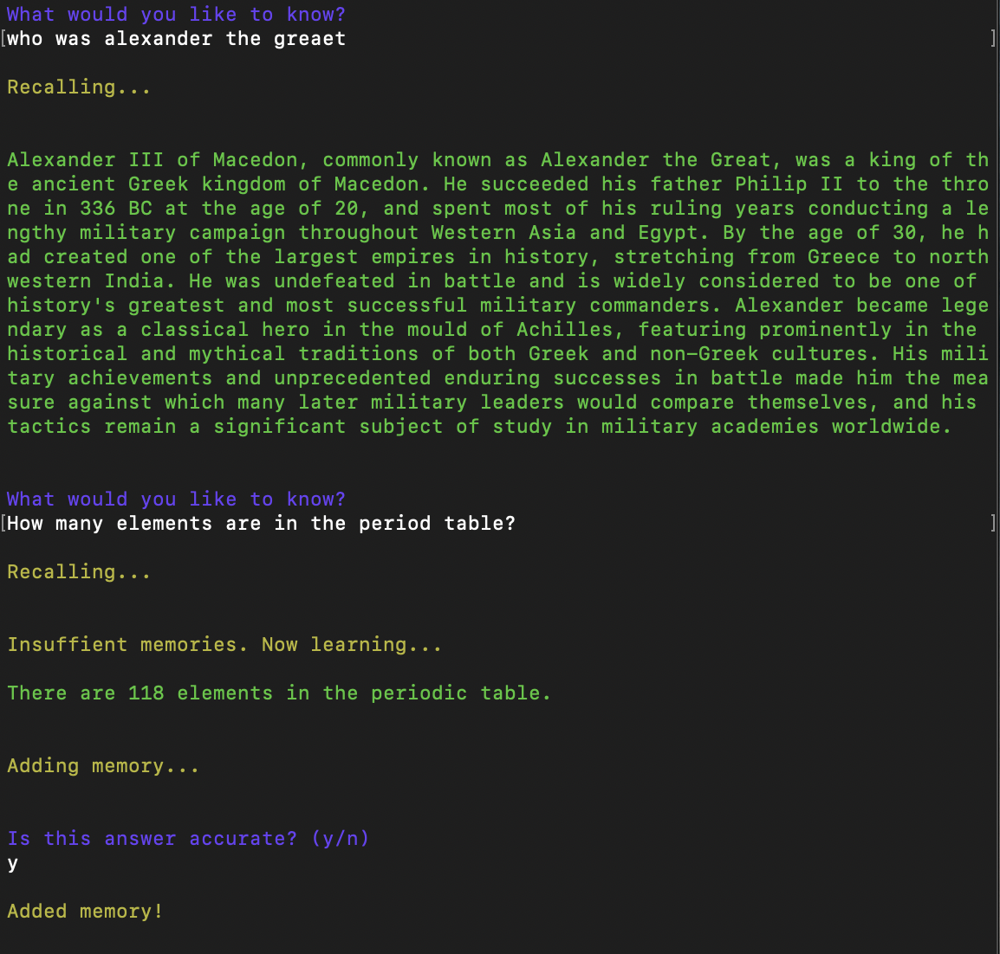

# AI Brainstore

This is a simple proof-of-concept for a brain for an AI agent.

See a [demo]().



## How It Works

Ask the agent a question.

If it knows the answer, then it will recall it from memory.

If it doesn't know the answer, then it will browse the web and learn about it.

As it learns, it will save its memories to its brain.

## Running Locally

**1. Clone Repo**

```bash
git clone https://github.com/mckaywrigley/ai-brainstore.git
```

**2. Install Dependencies**

```bash
npm i
```

**3. Configure Settings**

Create a .env.local file in the root of the repo with the following:

```bash
OPENAI_API_KEY=YOUR_KEY_HERE # required
DEFAULT_MODEL=gpt-3.5-turbo # or gpt-4
COLLECTION_NAME=ai-brainstore # name for your brainsstore
REVIEW_MEMORIES=TRUE # false to disable
SERPAPI_API_KEY=YOUR_KEY_HERE # optional (works way better if used!)
```

**4. Install & Run Chroma**

This project uses a local [Chroma](https://www.trychroma.com/) instance as its vector database, but you can use any vector database you want.

Note: You will need [Docker](https://www.docker.com/) to run Chroma locally.

```bash
git clone https://github.com/chroma-core/chroma.git
cd chroma
docker-compose up -d --build
```

**5. Run Script**

```bash
npm run agent
```

**6. Use It**

You should now be able to interact with the agent via the terminal.

## Contact

If you have any questions, feel free to reach out to me on [Twitter](https://twitter.com/mckaywrigley).
